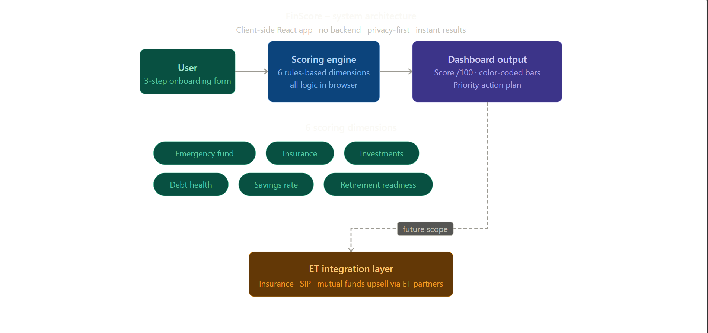

# FinScore – Your Money Health Score
### ET Gen AI Hackathon 2026 | Problem Statement 9: AI Money Mentor

## 🔗 Live Demo
👉 https://money-health-score--erstutidhawan.replit.app/

## 📌 Problem
- 95% of Indians have no financial plan
- Financial advisors cost ₹25,000+/year — accessible only to HNIs
- 14 crore+ demat accounts, but most investors are flying blind

## 💡 Solution
FinScore is a free, 5-minute Money Health Score tool built for every Indian investor — living inside ET. No advisor needed. Just answer a few questions and get a complete picture of your financial health instantly.

## 🧮 How It Works
1. User fills a 3-step onboarding form (Income & Savings → Protection → Debt & Future)
2. Scoring engine calculates score across 6 dimensions
3. Dashboard shows Score /100 + personalized action plan with exact ₹ amounts

## 📊 6 Scoring Dimensions
| Dimension | Max Points |
|---|---|
| Emergency Fund | 20 |
| Insurance Coverage | 15 |
| Investment Diversification | 20 |
| Debt Health | 15 |
| Savings Rate | 20 |
| Retirement Readiness | 10 |
| **Total** | **100** |

## 📈 Business Impact
- ET has 50M+ monthly users
- 1% adoption = **5 lakh Indians** get a financial plan
- Time saved per user: 3 hours of research → 5 minutes
- Each weak dimension = ET upsell opportunity (insurance, SIP, MF via ET partners)
- Estimated partner revenue per converted user: ₹500–2000

## 🏗️ Architecture


- Fully client-side React app
- No backend, no data stored — complete privacy
- Can be embedded into ET platform with zero infrastructure cost

## 📄 Impact Model
[View Impact Model](FinScore%20–%20Impact%20Model%20%26%20Business%20Case.pdf)

## 🛠️ Tech Stack
- React (frontend)
- Client-side scoring logic (no backend)
- Deployed on Replit

## 👥 Team
ET Gen AI Hackathon 2026 — Phase 2 Submission
```
